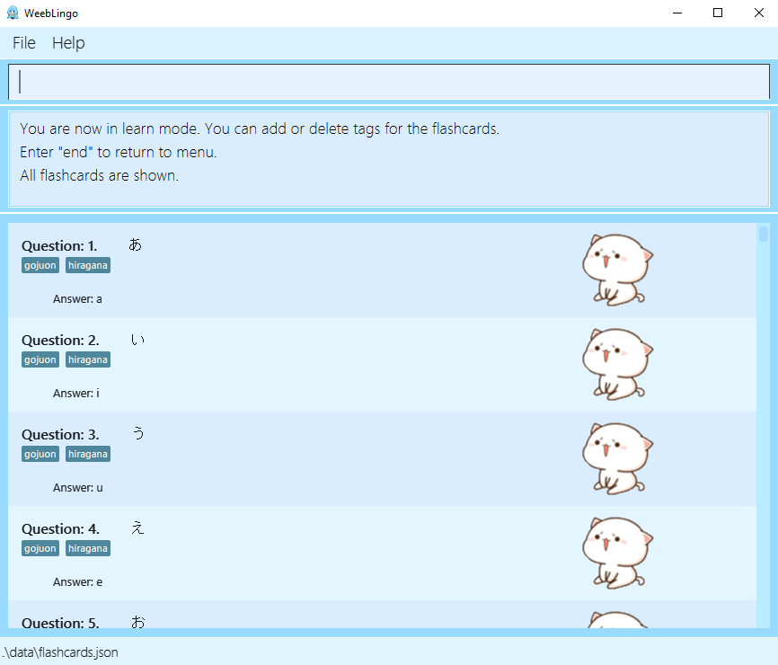
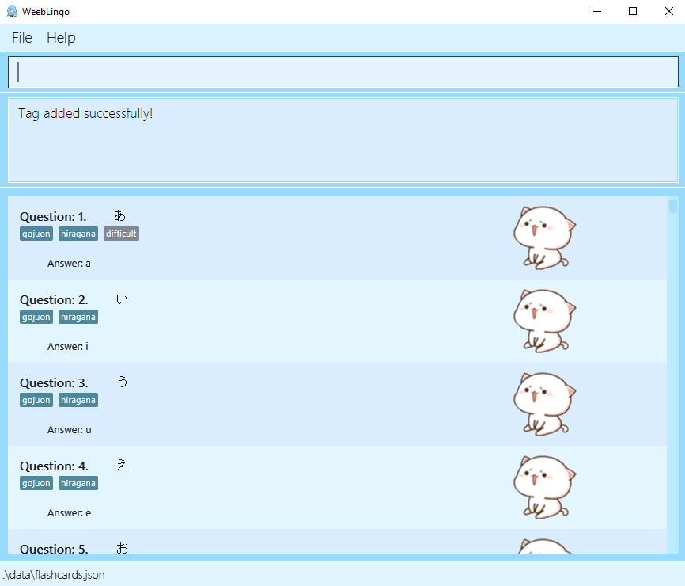
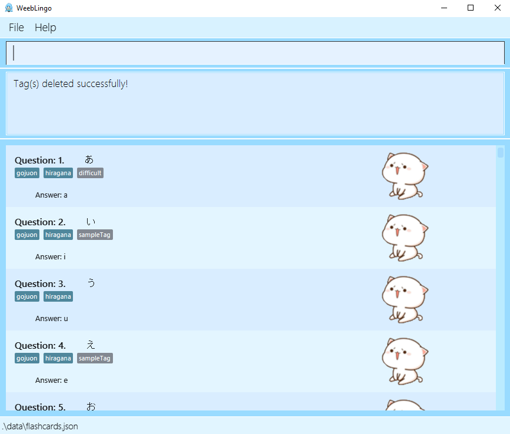
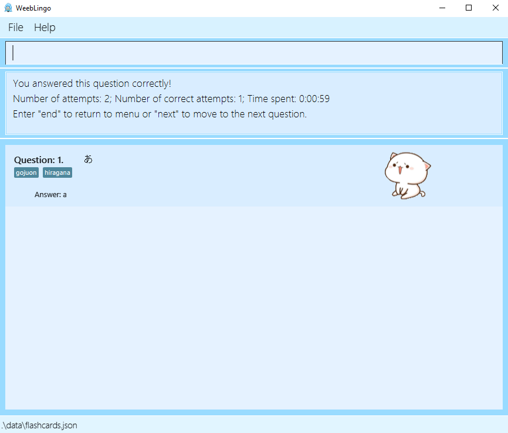
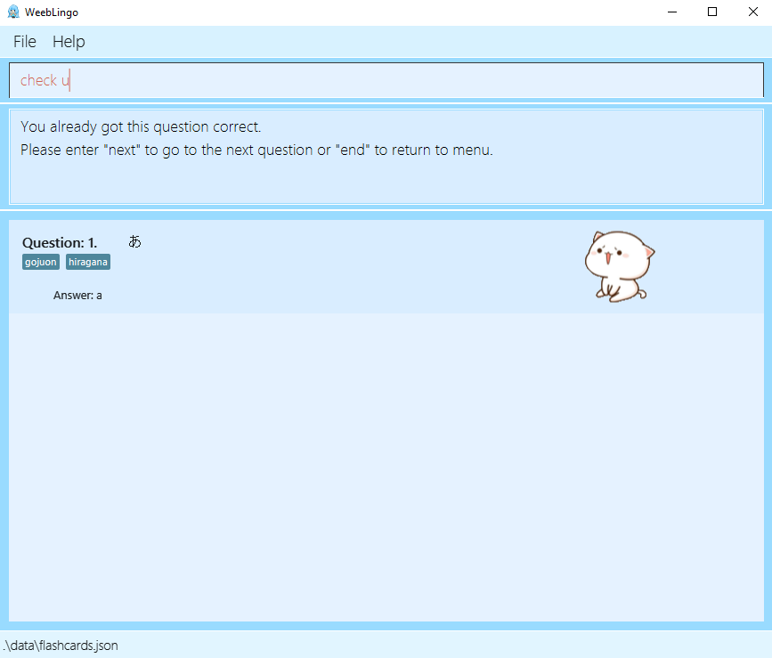

Weeblingo is a desktop application for **learning Japanese, optimized for use via a Command Line Interface** (CLI) while
still having the benefits of a Graphical User Interface (GUI). With a nice and friendly interface,
users can learn Japanese at a comfortable pace and manage flashcards with this application.

##Table of contents
* [Introduction](#introduction)
* [Quick Start](#quick-start)
* [Features](#features)
  * [**General Commands**](#general-commands)
     * [Ending the session: `end`](#ending-the-session-end)
     * [Asking for help: `help`](#asking-for-help-help)
     * [Exiting the application: `exit`](#exiting-the-application-exit)
  * [**Learn Mode Commands**](#learn-mode-commands)
     * [Entering learn mode: `learn`](#entering-learn-mode-learn)
     * [Tagging a flashcard: `tag`](#tagging-a-flashcard-tag)
     * [Deleting tags from a flashcard: `delete`](#deleting-tags-from-a-flashcard-deletetag)
  * [**Quiz Mode Commands**](#quiz-mode-commands)
     * [Entering quiz mode: `quiz`](#entering-quiz-mode-quiz)
     * [Starting a quiz session: `start`](#starting-a-quiz-session-start)
     * [Checking flashcard answers: `check`](#checking-flashcard-answers-check)
     * [Going to next flashcard: `next`](#going-to-next-flashcard-next)
  * [**History Mode Commands**](#history-mode-commands)
     * [Entering history mode: `history`](#entering-history-mode-history)
* [FAQ](#faq)
* [Command Summary](#command-summary)

--------------------------------------------------------------------------------------------------------------------

## Introduction

### About WeebLingo
WeebLingo is a desktop application that helps users learn the Japanese language. It has three primary modes,
which are the **learn**, **quiz** and **history** modes. The app contains flashcards that pairs a Japanese word and
its corresponding English syllable for users to learn. It allows users to test themselves on their grasp of the Japanese language
by starting a quiz session. In addition, users can view their history of past quiz attempts and the relevant statistics.

### Additional information
These are symbols used throughout the User Guide you might want to take note of.
* :information_source: : Indicates information that is likely to be helpful

--------------------------------------------------------------------------------------------------------------------

## Quick start

1. Ensure you have Java `11` or above installed in your Computer.

1. Download the latest `weeblingo.jar` from [here](https/linkhere-tbc).

1. Copy the file to the folder you want to use as the _home folder_ for your WeebLingo application.

1. Launch the app through running `java -jar weeblingo.jar` or double-clicking the icon. The GUI similar to the image below should appear in a few seconds.  
   

1. Type the command in the command box and press Enter to execute it. e.g. typing **`help`** and pressing Enter will open the help window. 
   Some example commands you can try:

   * **`learn`** : Enters Learn mode.

   * **`tag 1 t/easy`** : Tags the first flashcard shown as easy.

   * **`end`** : Returns to menu. 

   * **`exit`** : Exits the app.

1. Refer to the [Features](#features) below for details of each command.

--------------------------------------------------------------------------------------------------------------------

## Features

**:information_source: Notes about the command format:** 

* Words in `UPPER_CASE` are the parameters to be supplied by the user. 

* Items in square brackets are optional. 

* Items with `…`​ after them can be used multiple times including zero times. 

* Parameters can be in any order. 
eg. if the command specifies `n/NUMBER t/TAG`, `t/TAG n/NUMBER` is also acceptable.

* If a parameter is expected only once in the command but you specified it multiple times, only the last occurrence of the parameter will be taken. 
eg. if you specify `n/5 n/10`, only `n/10` will be taken.

* Extraneous parameters for commands that do not take in parameters (such as `help`, `list`, `exit` and `clear`) will be ignored. 
  e.g. if the command specifies `help あいうえお`, it will be interpreted as `help`.

## General Commands
Commands listed in this section can be run in all modes of the app.

### Ending the session: `end`

Prematurely ends the current quiz session. Quiz progress will not be saved if this is done.

The end command is only applicable while the user is in Quiz mode.

:information_source: **Note:** If you want to end your current quiz
session but want to see the statistics of the questions answered so far, consider skipping all questions until the 
end using next instead. The end command is meant as a way to quickly discard and close the current quiz session.

Format: `end`

### Asking for help: `help`

Shows a message explaning how to access the help page.

Format: `help`

### Exiting the application: `exit`

Exits the application.

Format: `exit`

## Learn Mode Commands

### Entering learn mode: `learn`

Enters Learn Mode, where all current flashcards are listed out. Answers to current flashcards are shown as well.

Users can utilise this mode to facilitate the learning process,
and look through complete flashcards without having to test themselves.

Tagging related functions are also only available in this mode.

Format: `learn`

Learn Mode:

### Tagging a flashcard: `tag`

Reads in a positive index and one or more tags, and adds these tags to the flashcard at the desired index.
At least one tag must be provided, else the user will be prompted to enter a valid command.

Tagging of flashcards can only be done in Weeblingo's Learn Mode.

:information_source: **Note:** Default tags are provided by Weeblingo,
which can neither be deleted nor edited.
The purpose of this command is to allow users to add their own tags as well to assist in the learning process.

Format: `tag INDEX t/TAGS…`

Examples:
* `tag 1 t/difficult`
* `tag 5 t/fire`

After successfully adding a tag:

### Deleting tags from a flashcard: `deleteTag`

Reads in a positive index and zero or more tags, and removes these tags from the flashcard at the desired index.
If no tags are provided, all user-added tags will be removed from the flashcard.

Tagging of flashcards can only be done in Weeblingo's Learn Mode.

:information_source: **Note:** Default tags are provided by Weeblingo, which can neither be deleted nor edited.
The purpose of this command is to allow users to delete tags added by themselves.

Format: `deleteTag INDEX [t/TAGS…]`

Examples:
* `deleteTag 3`
* `deleteTag 1 t/difficult`

After successfully deleting sampleTag from the flashcard at index 3:

## Quiz Mode Commands

### Entering quiz mode: `quiz`

Enters Quiz Mode, where all current flashcards are listed out. Answers to current flashcards are not shown.

Format: `quiz [t/TAG]...`

### Starting a quiz session: `start`

Starts a quiz session.

Format: `start [n/NUMBER] [t/TAG]...`

* NUMBER specifies the number of questions for the quiz session.
* TAG specifies the type of questions for the quiz session.
* NUMBER specified should be positive.
* There are currently four tags available, gojuon, hiragana, katakana and numbers.
* You can specify one or two tags.

Examples:
* `start n/10`
* `start t/katakana`
* `start n/5 t/gojuon t/hiragana`

Before executing start command:

After executing start command:

### Checking flashcard answers: `check`

Reads in user attempt and check if it matches the answer of currently shown flashcard question. 
Each time a check command is executed, number of attempts increment by one.
If attempt is correct, answer to the current flashcard will be displayed and number of correct attempt is displayed.
Else user may choose to try again, skip the question though `next` or end the session through `end`. 

Format: `check ATTEMPT`

Examples:
* `check a`
* `check hi`

If user attempt matches correct answer of flashcard:

If user attempt does not match correct answer of flashcard:

If user tries to answer already correctly answered flashcard:

### Going to next flashcard: `next`

Goes to the next flashcard in the quiz session, if any.

Format: `next`

## History Mode Commands

### Entering history mode: `history`

View scores of all past quiz attempts.

Format: `history`

### Adding and removing entries `[coming in v2.0]`

_Details coming soon ..._

--------------------------------------------------------------------------------------------------------------------

## FAQ

**Q**: How do I transfer my quiz attempt scores to other computers? 
**A**: Install the app in the other computer and overwrite the empty data file it creates with the file
that contains the data of your previous WeebLingo home folder.

**Q**: Can I add my customized flashcards? 
**A**: Sorry, the current version of the application does not allow self-defined flashcards to be added. However, if you
are advanced and know how to manipulate the storage files, you can do so if you want.

--------------------------------------------------------------------------------------------------------------------

## Command summary

Action | Format, Examples |
-------|------------------|
**Quiz** | `quiz`
**Start** | `start`
**Check** | `check ATTEMPT`   e.g. `check a`
**Next** | `next`
**Learn** | `learn`
**End** | `end`
**History**|`history`
**Tag**| `tag INDEX t/TAGS…`   e.g. `tag 1 t/difficult`
**DeleteTag**| `deleteTag INDEX [t/TAGS…]`   e.g. `deleteTag 1 t/difficult`, `deleteTag 3`
**Exit** | `exit`
**Help** | `help`
