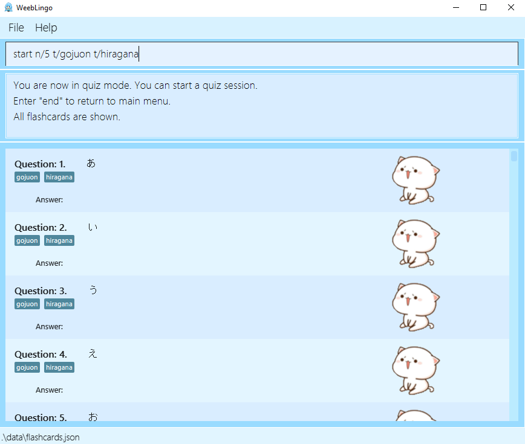
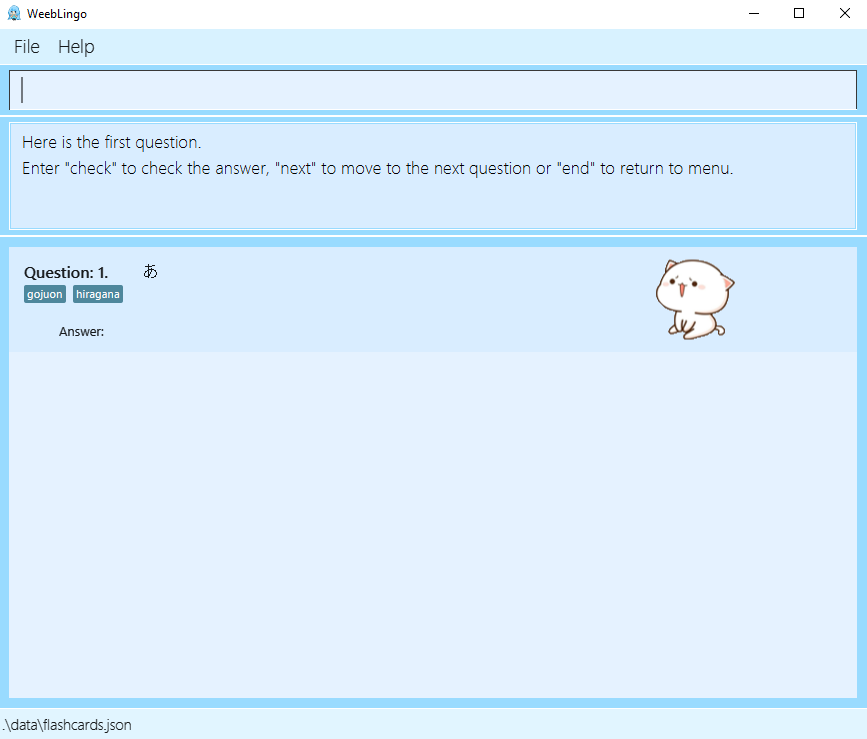

Weeblingo is a desktop application for **learning Japanese, optimized for use via a Command Line Interface** (CLI) while 
still having the benefits of a Graphical User Interface (GUI). With a nice and friendly interface, 
users can learn Japanese at a comfortable pace and manage flashcards with this application.

* [Quick Start](#quick-start)
* [Features](#features)
  * [Starting a quiz session: `start`](#starting-a-quiz-session-start)
  * [Checking flashcard answers: `check`](#checking-flashcard-answers-check)
  * [Going to next flashcard: `next`](#going-to-next-flashcard-next)
  * [Listing out all flashcards: `learn`](#listing-out-all-flashcards-learn)
  * [Ending the session: `end`](#ending-the-session-end)
  * [Viewing past scores: `history`](#viewing-past-scores-history)
  * [Exiting the application: `exit`](#exiting-the-application-exit)
  * [Asking for help: `help`](#asking-for-help-help)
* [FAQ](#faq)
* [Command Summary](#command-summary)

--------------------------------------------------------------------------------------------------------------------

## Introduction

### About WeebLingo
WeebLingo is a desktop application that helps users learn the Japanese language. It has three primary modes, 
which are the **learn**, **quiz** and **history** modes. The app contains flashcards that pairs a Japanese word and 
its corresponding English consonant for users to learn. It allows users to test themselves on their grasp of the Japanese language
by starting a quiz session. In addition, users can view their history of past quiz attempts and the relevant statistics.

### Additional information 
These are symbols used throughout the User Guide you might want to take note of.
* :information_source: : Indicates information that is likely to be helpful

--------------------------------------------------------------------------------------------------------------------

## Quick start

1. Ensure you have Java `11` or above installed in your Computer.

1. Download the latest `weeblingo.jar` from [here](https/linkhere-tbc).

1. Copy the file to the folder you want to use as the _home folder_ for your WeebLingo application.

1. Double-click the file to start the app. The GUI similar to the image below should appear in a few seconds.  
   

1. Type the command in the command box and press Enter to execute it. e.g. typing **`help`** and pressing Enter will open the help window. 
   Some example commands you can try:

   * **`start`** : Shows the first flashcard.

   * **`check`** : Gives the answer to previously shown flashcard.

   * **`next`** : Only entered after show or check, goes to next flashcard.

   * **`exit`** : Exits the app.

1. Refer to the [Features](#features) below for details of each command.

--------------------------------------------------------------------------------------------------------------------

## Features

**:information_source: Notes about the command format:** 

* Words in `UPPER_CASE` are the parameters to be supplied by the user. 

* Items in square brackets are optional. 

* Items with `…`​ after them can be used multiple times including zero times. 

* Parameters can be in any order. 
eg. if the command specifies `n/NUMBER t/TAG`, `t/TAG n/NUMBER` is also acceptable.

* If a parameter is expected only once in the command but you specified it multiple times, only the last occurrence of the parameter will be taken. 
eg. if you specify `n/5 n/10`, only `n/10` will be taken.

* Extraneous parameters for commands that do not take in parameters (such as `help`, `list`, `exit` and `clear`) will be ignored. 
  e.g. if the command specifies `help あいうえお`, it will be interpreted as `help`.

### Starting a quiz session: `start`

Starts a quiz session.

Format: `start [n/NUMBER] [t/TAG]`

* NUMBER specifies the number of questions for the quiz session.
* TAG specifies the type of questions for the quiz session.
* NUMBER specified should be positive.
* There are currently four tags available, gojuon, hiragana, katakana and numbers.
* You can specify one or two tags.

Examples:
* start n/10
* start t/katakana
* start n/5 t/gojuon t/hiragana

Before executing start command:

After executing start command:

### Checking flashcard answers: `check`

Reveals the answer to the previous shown flashcard.

Format: `check`

### Going to next flashcard: `next`

Goes to the next flashcard, if any.

Format: `next`

### Listing out all flashcards: `learn`

Enters Learn Mode, where all current flashcards are listed out.

Format: `learn`

### Ending the session: `end`

Ends the current session, saving progress.

Format: `end`

### Viewing Past Scores: `history`

View scores of all past quiz attempts.

Format: `history`

### Exiting the application: `exit`

Exits the application.

Format: `exit`

### Asking for help: `help`

Shows a message explaning how to access the help page. (to be updated)

Format: `help`

### Adding and removing entries `[coming in v2.0]`

_Details coming soon ..._

--------------------------------------------------------------------------------------------------------------------

## FAQ

**Q**: How do I transfer my quiz attempt scores to other computers? 
**A**: Install the app in the other computer and overwrite the empty data file it creates with the file
that contains the data of your previous WeebLingo home folder.

**Q**: Can I add my customized flashcards? 
**A**: Sorry, the current version of the application does not allow self-defined flashcards to be added. However, if you
are advanced and you know how to manipulate the storage files, you can do so if you want.

--------------------------------------------------------------------------------------------------------------------

## Command summary

Action | Format, Examples |
-------|------------------|
**Start** | `start`
**Check** | `check`
**Next** | `next`
**Learn** | `learn`
**End** | `end`
**History**|`history`
**Exit** | `exit`
**Help** | `help`
